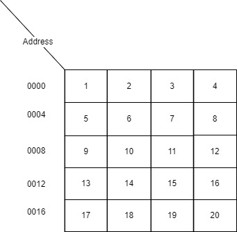

This tutorial is providing brief overview of how variables are created in computer memory and how those values are stored in the memory space.

<!--more-->

## What happens when we create a variable?
                                                      
The computers these days are extremely fast and even though efficient and non-efficient algorithm might produce output in almost similar amount of time to bare eyes. They do differ in their speed. This may not be noticeable for small dataset, but if the input size increases by thousands, it will clearly be visible which algorithm is performing faster.

RAM in computer memory is limited in size, usual size being 8GB, 16GB. Accessing memory from any location is fast and is considered as a constant time operation and is to considered in the calculations of time analysis. Let's see what happens when we initialize a variable.

We can visualize memory as a 2D array of boxes. These boxes are empty at the beginning. In reality, they will contain some garbage value which is of no use. In below diagram, I have shown only 20 blocks of memory. Assume that each memory block is one byte long for simple illustration.



In this case, the memory address 0000 has the value `0`. I have marked the memory addresses using decimal numbers but in reality they are numbered using 0s and 1s. That is they are actually marked in hexadecimal number format. When we initialize a new variable, the variable is just an alias to memory location and that memory location contains the value assigned to the variable. This is how variables are created in memory for primitives in most languages. 

## How is Data stored?

When we create a value of integer or string data type, those are actually converted into binary representation. That is values of 1s and 0s. As you might know, that computers store everything in the form of 1s and 0s. So, there must be some conversion to convert whatever we enter into binary representation. It turns out mathematicians have already solved this using Decimal to Binary representation. Decimal are the numbers as we know them in real life. Binary is the number representation in the form of 1s and 0s which computers can understand and store.

OK, so numbers can be converted into binary representation but how are string values stored? It turns out that each string character can also be converted into numbers by using ASCII characters. This basically maps each alphabetic character into a number representation. There are several other encoding schemes like this, but this was just to explain that everything is stored as numbers in computer memory.

## Memory for JVM Languages

Now if we think about object oriented programming languages like Java or JVM languages, it divides the system memory into two types of memory: (1) Java Heap Space (2) Stack memory. Let's talk a little bit about those two types as well.

### 1. Java Heap Space

Heap space is used by JRE to allocate memory for reference types. This also includes available JRE classes or libraries that you're using in your project. When we create a new instance of a class, it is stored in this heap space and the variable is assigned the reference to that space. Heap space is also managed by JVM, so it will clean up those objects which are no longer needed. That's part of garbage collection process.

### 2. Stack 

Java stack space is used during the execution of a function or thread. This stored temporary variables as well as references to objects in the heap space. This is simple data structure stack which is LIFO (Last In First Out). During execution of a method in Java program, a new stack space is allocated and that space will hold temporary local variables like arguments and anything we create in the method block. When we are modifying values of these local variables, we are actually modifying these local variables in stack memory. When this function or method execution ends, this block of memory is released so those temporary variables are no longer available. Stack memory is used for relatively small period of time and that's why it is usually quite less compared to heap space. The memory operations are also relatively fast such as allocating and deallocating memory from Stack takes very less time compared to Heap space. That is because heap space has to meet certain conditions in order to allocate those memory. For example, in the case of array those memory blocks have to be contiguous.

### Example Demo

```java
public class DemoClass {
    public static void main(String[] args) {
        int quantity = 10;
        double amount = 10.10;
        System.out.println(amount);
        Object obj1 = new Object();
        DemoClass demo = new DemoClass();
        demo.testMethod(quantity, obj1);
    }

    public void testMethod(int input, Object obj) {
        input += 1;
        System.out.println(obj.toString());
        System.out.println(input);
    }
}
```

In this case, I have defined a very simple `DemoClass` which has single method `testMethod` and a `main()` method. When this code executes, following sequence of events occur.

1. First `main` method gets called which creates a new stack memory for the program execution in stack space.
2. In `main` method, we created local variable `quantity` which is primitive type, so this is created in the stack memory.
3. On next line, again we have primitive type `amount` which is again created in the stack memory and takes up space equal to size of the data type.
4. Printing of the lines does not take up space, they are only included for the use of those variables.
5. Next, we create an object. So, this is created in the heap space and a reference to that object is created in the stack space. In this case, we have denoted them with arrow and a memory location.
6. Next line also creates an object of type `DemoClass`, so this also creates a new reference in stack space with actual object being stored in the heap space.
7. When we call method `testMethod` of the object, this creates a brand new stack space for `testMethod` execution. In this case, we are passing two arguments: one which is primitive and another which is of reference type. Since Java uses pass-by-value for primitives and pass-by-reference for objects, it will create new local variable `input` in stack and a new reference pointing to same object in the stack space of the `testMethod`.
8. When we modify the local variable, the stack variable for `testMethod` gets modified and not the original variable `quatity` fro `main` method.
9. However, if we modify the variable `obj` in `testMethod`, since this is a reference to the original variable `obj1`, it will modify the member variables of the original object if there were any.

In languages like C and C++, C#, this model is almost similar except that C does not have object types.
So, this was a brief tutorial on how memory works under the hood when we execute any program.


