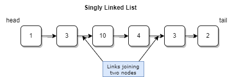
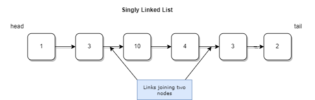

Lists, as the name suggests, are list of items. These item can be of any type. We can have list of Integer or list of Double or even we can have list of custom data types. Lists elements are stored differently than arrays which gives it certain advantages over arrays. We will see those in this tutorial.

<!--more-->

## List Overview

`List` is pointer based data structure which relies heavily on pointers to the next item. Lists consist of nodes where each node contains the data associated with the type of list and the pointer to the next node element. Again, next node contains the same information, its data and the pointer to next node and so on until the last element. The first element of the list is called the **head** and similarly the last element is called **tail**. 

This implementation detail has certain advantages and disadvantages over Array based Lists. With this implementation, we cannot access element at a specific index in constant time. We have to traverse the list from beginning or end depending on the type of list to reach to specific index position and then retrieve that element. However, this also gives it an advantage that we can easily add new element or remove an element in constant time regardless of the size of the list.

The lists can be mainly categorized into two main types.

1. Singly Linked List
2. Doubly Linked List

This lesson focuses on Singly Linked List.

## What is Singly Linked List

In singly linked lists, we have single directional connections from head towards the tail. We cannot traverse backwards. Visually it looks like below.






To create singly linked list, we first need a single node which can be defined like below. For the sake of simplicity, I have marked member variables as `public`.

```java
class Node {
    public int value;
    public Node next;

    public Node() {

    }

    public Node(int value) {
        this.value = value;
    }
}
```

As you can see, we have two member variables, one of type `int` to store integer values in this simple linked list and another `Node` itself to store pointer to the next node.

Now, this List should support several operations.


```java
public class SinglyLinkedList {

    private Node head;
//    private Node tail;
    private int size;
`
0


`
    public SinglyLinkedList() {
        this.head = null;
//        this.tail = null;
        this.size = 0;
    }

    public SinglyLinkedList(int value) {
        Node node = new Node(value);
        this.head = node;
        this.size = this.size++;
    }

    public int get(int index) {
        if (index < 0 || index >= size) return -1;
        Node currentNode = this.head;
        for (int i = 0; i < index; i++) {
            currentNode = currentNode.next;
        }
        return currentNode.value;
    }

    public void insert(int value) {
        Node newNode = new Node(value);
        if (this.head == null) {
            this.head = newNode;
//            this.tail = newNode;
            this.size++;
            return;
        }
        Node currentNode = this.head;
//        this.tail.next = newNode;
//        this.tail = newNode;
        // without tail use below.
        while (currentNode.next != null) {
            currentNode = currentNode.next;
        }
        currentNode.next = newNode;
        this.size++;
    }

    public void insert(int index, int value) {
        if (index > size) return;
        if (index < 0) index = 0;
        this.size++;
        Node currentNode = this.head;
        for (int i = 0; i < index - 1; i++) {
            currentNode = currentNode.next;
            System.out.println("after for loop" + Integer.toString(i) + " : " + currentNode);
        }

        Node newNode = new Node(value);
        if (currentNode.next == null) {
            newNode.next = null;
        } else {
            newNode.next = currentNode.next;
        }
        currentNode.next = newNode;
        System.out.println("end of loop");
    }

    public void prepend(int value) {
        this.insert(0, value);
    }

    public void append(int value) {
        this.insert(this.size, value);
    }

    public void delete(int index) {
        if (index < 0 || index >= this.size) return;
        this.size--;
        if (index == 0) {
            this.head = this.head.next;
            return;
        }
        Node currentNode = this.head;
        for (int i = 1; i < index; i++) {
            currentNode = currentNode.next;
        }
        currentNode.next = currentNode.next.next;
    }

    public int size() {
        return this.size;
    }

    public int find(int data) {
        Node currentNode = this.head;
        for (int i = 0; i < this.size; i++) {
            if (currentNode.value == data)
                return i;
            currentNode = currentNode.next;
        }
        return -1;
    }

    // TODO: Implement other methods

    public void print() {
        Node currentNode = head;
        if (this.size == 0) {
            System.out.println("Empty List");
        }
        while (currentNode != null) {
            System.out.printf("%d => ", currentNode.value);
            currentNode = currentNode.next;
        }
        System.out.println();
    }
}
```
