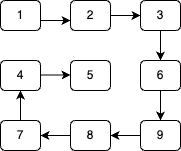
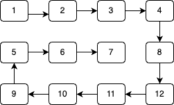

## Description

Given an m x n matrix, return all elements of the matrix in spiral order.

### Example 1:

```
Input: matrix = [[1,2,3],[4,5,6],[7,8,9]]
Output: [1,2,3,6,9,8,7,4,5]
```



### Example 2:

```
Input: matrix = [[1,2,3,4],[5,6,7,8],[9,10,11,12]]
Output: [1,2,3,4,8,12,11,10,9,5,6,7]
```



### Constraints:

- `m == matrix.length`
- `n == matrix[i].length`
- `1 <= m, n <= 10`
- `-100 <= matrix[i][j] <= 100`

## Solution

This solution requires applying complex logic based on the navigation we want to perform. So, not so much logical in this case. It simply uses loop and conditionals.

```java
class Solution {
    public List<Integer> spiralOrder(int[][] matrix) {
        int m = matrix.length, n = matrix[0].length;
        int top = 0, bottom = m - 1, left = 0, right = n - 1;
        List<Integer> result = new ArrayList<>();
        while (left <= right && top <= bottom) {
            for (int j = left; j <= right; ++j) {
                result.add(matrix[top][j]);
            }
            for (int i = top + 1; i <= bottom; ++i) {
                result.add(matrix[i][right]);
            }
            if (left < right && top < bottom) {
                for (int j = right - 1; j >= left; --j) {
                    result.add(matrix[bottom][j]);
                }
                for (int i = bottom - 1; i > top; --i) {
                    result.add(matrix[i][left]);
                }
            }
            top++;
            bottom--;
            left++;
            right--;
        }
        return result;
    }
}
```