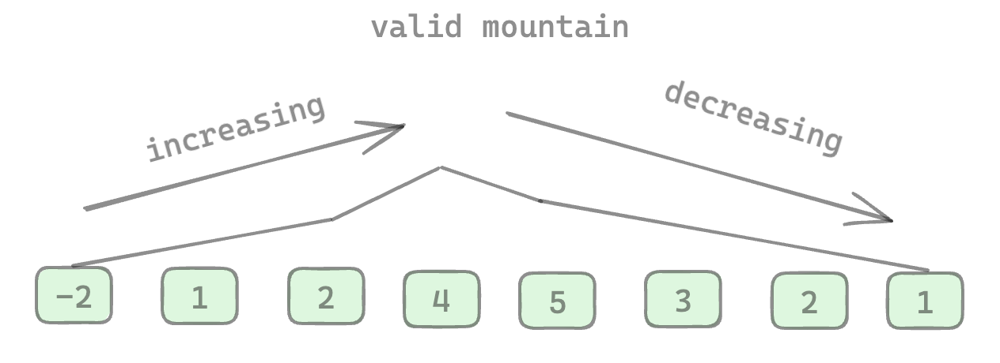
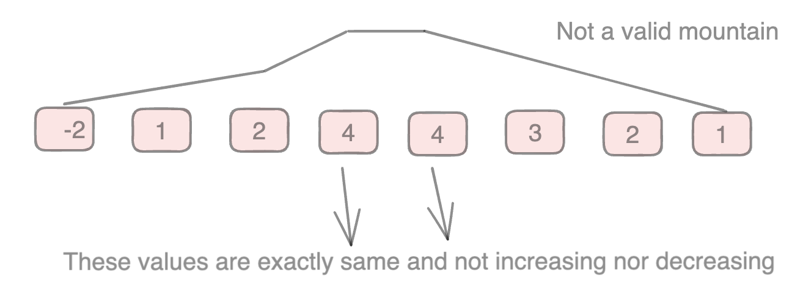
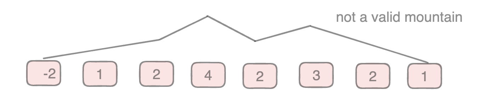

## Description

Given an array of integers arr, return true if and only if it is a valid mountain array.

Recall that arr is a mountain array if and only if:

- `arr.length >= 3`
- There exists some `i` with `0 < i < arr.length - 1` such that:
    - `arr[0] < arr[1] < ... < arr[i - 1] < arr[i] `
    - `arr[i] > arr[i + 1] > ... > arr[arr.length - 1]`

Valid mountain array has a single peak. For example, below array has single peak with value of 5. All elements on left of this peak are lower and all elements on the right are lower. Also the difference increases in both side strictly. It does not remain same nor does it decrease in between those numbers.



The next array looks like a mountain but it has same value for elements at index position 3 and 4. So, it is not strictly valid mountain.



Again, if the mountain has more than one peak, then also it's not a valid mountain like example below.



### Example 1:

```
Input: arr = [2,1]
Output: false
```

### Example 2:

```
Input: arr = [3,5,5]
Output: false
```

### Example 3:

```
Input: arr = [0,3,2,1]
Output: true
``` 

### Constraints:

- `1 <= arr.length <= 10^4`
- `0 <= arr[i] <= 10^4`

## Solution

First constraint it that the array has to have at least 3 elements. If not, it cannot be a mountain and we have to return `false`. To solve this, we can traverse from two ends.
First we start iterating from the left as long as we see number on the right being greater than previous number. When this condition becomes `false`, we start iterating from the right checking that previous number is less than current number. When this condition also becomes `false`, we should be at the same peak value which is what we got when traversing from the left side.

```java
class Solution {
    public boolean validMountainArray(int[] arr) {
        if (arr.length < 3)
            return false;

        int left = 0, right = arr.length - 1;
        while (left + 1 < arr.length - 1 && arr[left] < arr[left + 1]) {
            left++;
        }
        while (right - 1 > 0 && arr[right] < arr[right - 1]) {
            right--;
        }
        return left == right;
    }
}
```

- Time Complexity: `O(n)`
- Space Complexity: `O(1)`