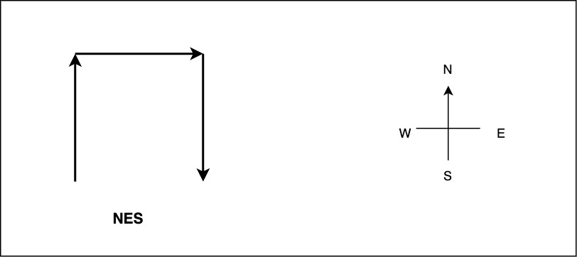
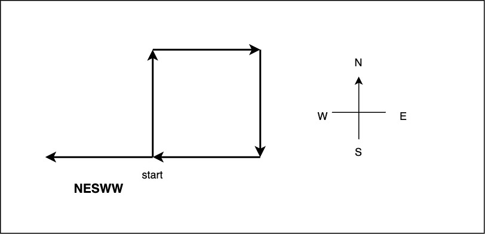

## Description

Given a string `path`, where `path[i] = 'N'`, `'S'`, `'E'` or `'W'`, each representing moving one unit north, south, east, or west, respectively. You start at the origin `(0, 0)` on a 2D plane and walk on the path specified by `path`.

Return `true` if the path crosses itself at any point, that is, if at any time you are on a location you have previously visited. Return `false` otherwise.

### Example 1


```
Input: path = "NES"
Output: false 
Explanation: Notice that the path doesn't cross any point more than once.
```

### Example 2



```
Input: path = "NESWW"
Output: true
Explanation: Notice that the path visits the origin twice.
```

### Constraints:

- `1 <= path.length <= 104`
- `path[i]` is either `'N'`, `'S'`, `'E'`, or `'W'`.

## Solution

In this case, we want to know if we visited the same point again in our traversal. Again, we can store these points we have visited in some hash data structure and track if we had already visited this point. Now, the problem can be divided into two parts, calculating current position from the traversal character and second is keeping track of these positions in the form of x and y coordinates in Hash data structure.

1. In order to convert each movement into their respective position, we simply have modify one of the coordinates. The problem states that we are moving only one unit with each character. 

    - For `N` or north, move only Y coordinate by +1.
    - For `S` or south, move only Y coordinate by -1.
    - For `E` or east, move only X coordinate by +1.
    - For `W` or west, move only X coordinate by -1.

To store X and Y coordinates, we can use tuple or Java `Pair`, however, I have used `List` to track these two coordinates. `list(0)` represents X coordinate and `list(1)` represents Y coordinate.

2. To store these coordinate points, we need a data structure. We can use them as a string separated by comma or some other charactes like `x,y` or `x:y` format or again, we can use a data structure that has `hashCode` defined. In this solution, I have used `List<Integer>`

```java
class Solution {
    public boolean isPathCrossing(String path) {
        List<Integer> currentPosition = new ArrayList<>(Arrays.asList(0, 0));
        Set<List<Integer>> visitedPositions = new HashSet<>();
        visitedPositions.add(currentPosition);
        for (char c: path.toCharArray()) {

            switch (c) {
                case 'N':
                    currentPosition = new ArrayList<>(Arrays.asList(
                        currentPosition.get(0), currentPosition.get(1) + 1)
                        );
                    break;
                case 'S':
                    currentPosition = new ArrayList<>(
                        Arrays.asList(currentPosition.get(0), currentPosition.get(1) - 1)
                        );
                    break;
                case 'E':
                    currentPosition = new ArrayList<>(
                        Arrays.asList(currentPosition.get(0) + 1, currentPosition.get(1))
                        );
                    break;
                case 'W':
                    currentPosition = new ArrayList<>(
                        Arrays.asList(currentPosition.get(0) - 1, currentPosition.get(1))
                        );
                    break;
            }

            if (visitedPositions.contains(currentPosition)) {
                return true;
            }
            visitedPositions.add(currentPosition);
        }
        return false;
    }
}
```

- Time Complexity: `O(n)`
- Space Complexity: `O(n)`