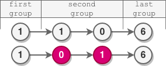
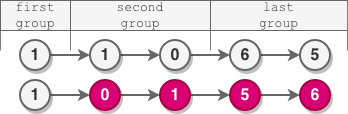

## Description

You are given the `head` of a linked list.

The nodes in the linked list are sequentially assigned to non-empty groups whose lengths form the sequence of the natural numbers `(1, 2, 3, 4, ...)`. The length of a group is the number of nodes assigned to it. In other words,

The 1st node is assigned to the first group.
The 2nd and the 3rd nodes are assigned to the second group.
The 4th, 5th, and 6th nodes are assigned to the third group, and so on.
Note that the length of the last group may be less than or equal to `1 + the length of the second to last group`.

Reverse the nodes in each group with an even length, and return the `head` of the modified linked list.

### Example 1:

```
Input: head = [5,2,6,3,9,1,7,3,8,4]
Output: [5,6,2,3,9,1,4,8,3,7]
Explanation:
- The length of the first group is 1, which is odd, hence no reversal occurs.
- The length of the second group is 2, which is even, hence the nodes are reversed.
- The length of the third group is 3, which is odd, hence no reversal occurs.
- The length of the last group is 4, which is even, hence the nodes are reversed.
```


### Example 2:

```
Input: head = [1,1,0,6]
Output: [1,0,1,6]
Explanation:
- The length of the first group is 1. No reversal occurs.
- The length of the second group is 2. The nodes are reversed.
- The length of the last group is 1. No reversal occurs.
```



### Example 3:

```
Input: head = [1,1,0,6,5]
Output: [1,0,1,5,6]
Explanation:
- The length of the first group is 1. No reversal occurs.
- The length of the second group is 2. The nodes are reversed.
- The length of the last group is 2. The nodes are reversed.
```



### Constraints:

- The number of nodes in the list is in the range `[1, 10^5]`.
- `0 <= Node.val <= 10^5`

## Solution

Here, we need to reverse only even length groups. If the group has a length of odd number, then we do not need to reverse it. For this we can iterate through the list and in each iteration we track `group`. First we find the number of nodes in the given group because it is possible that a `group` may have less number of nodes if it is the last group. So, we always have to check the number of nodes in the group. Once we have the group, if the group is **even**, we have to reverse it else we keep it as it is.

```java
class Solution {
    public ListNode reverseEvenLengthGroups(ListNode head) {
        int group = 2;
        ListNode current = head.next;
        ListNode prev = head;
        while(current != null) {
            ListNode groupCurrent = current;
            ListNode groupPrev = prev;
            int numNodes = 1;
            while(current != null && numNodes <= group) {
                prev = current;
                current = current.next;
                numNodes++;
            }
            numNodes = numNodes - 1;
            if(numNodes % 2 == 0) {
                ListNode newHead = reverse(groupCurrent, Math.min(numNodes, group));
                groupPrev.next = newHead;
                prev = groupCurrent;
            }
            group++;
        }
        return head;
    }


    private ListNode reverse(ListNode head, int count) {
        ListNode prev = null;
        ListNode curr = head;
        ListNode next = null;
        while(curr != null && count > 0) {
            next = curr.next;
            curr.next = prev;
            prev = curr;
            curr = next;
            count--;
        }
        head.next = next;
        return prev;
    }
}
```

- Time Complexity: `O(n)`
- Space Complexity: `O(1)`