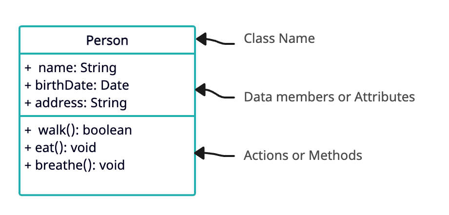

This tutorial aims to revise the concepts of object-oriented programming. This includes inheritance, polymorphism, abstraction, encapsulation and few other concepts of object-oriented programming.
<!--more-->

## What is Object-Oriented Programming?

Object-oriented programming (OOP) is a programming paradigm based on the idea of wrapping everything in the form of objects. Objects may consist of data members and actions we can perform on them. Each object may have its own data values which uniquely identifies each object. To define multiple objects of the same type, we defin classes. Class is basically a blueprint which defines what properties each of the objects may have.

Below is a UML diagram which represents a very simple class `Person`. UML digrams are a way to represent low level design in the diagram. It depicts aspects of each class with their member variables and methods.



In this class, at the top we have class name `Person` which has three data members: `name`, `birthDate` and `address`. Each of them have their data type defined separated by colon (`:`) symbol. The bottom section has the methods defined in this class which in this case are `walk()`, `eat()` and `breathe()`. In the upcoming tutorial, we will learn more about UML diagrams and how they can represent different class states.

Once we have this class created, we can define as many objects as we want. Object is an instance of a class. Each objects have their own data members so they can have different values associated with each object. In Java, we define classes like this.

```java
import java.util.Date;

public class Person {
    public String name;
    public Date dateOfBirth;
    public String address;

    public Person(String name, Date dateOfBirth, String address) {
        this.name = name;
        this.dateOfBirth = dateOfBirth;
        this.address = address;
    }

    public boolean walk() {
        System.out.println("I am walking");
        return true;
    }

    public void eat() {
        System.out.println("I am eating");
    }

    public void breathe() {
        System.out.println("I am breathing");
    }
}
```

In OOP, we think of systems in terms of real world objects.

## Pillars of OOP (Object-Oriented Programming)

This is a very simple system with single class. In real-world, we will have systems built from multiple classes; hundreds or even thousands of classes. In those kinds of situations, we will need mechanisms to connect different classes and get the system to work properly. For this, we can use features like inheritance, polymorphism to achieve the required task. There are four main pillars of object-oriented programming. They are abstraction, encapsulation, inheritance and polymorphism.

### Abstraction

In object-oriented programming, we model the system to match real-world objects. However, we don't match the system 100% to the real world objects. It only represents the objects in the context of the system we are building. Abstraction is the method of extracting out the necessary details and characteristics of an object to represent it in the programming context. It hides the unnecessary internal workings or complexity and only reveals the high-level mechanisms essentially needed for object operation.

The class definition for `Book` will be very different for a systems of e-commerce vs a library. They will have different set of attributes and methods for each of these systems even though some of the attributes might be same. For example, an e-commerce store might store the size of the book which might not be relevant for a library. So, we abstract away the unnecessary information from the objects.

#### abstract class

In Java, we achieve abstraction primarily through abstract classes and interfaces. An abstract class is a class that cannot create instances. It often contains one or more abstract methods (methods declared but not implemented). 

```java
abstract class Animal {
    abstract void breathe();
}

class Dog extends Animal {
    void breathe() {
        System.out.println("Dog is breathing");
    }
}
```

In this scenario, `Animal` represents an abstract concept. However, a `Dog` is a concrete Animal that appropriately implements the `eat()` method inherited from `Animal`.

#### interface

Interface, on other other hand, can have only definition of methods. They cannot have concrete implementations except default methods. An Interface in Java purely represents abstraction. It only contains empty methods (method declaration without body) which the implementing class should define.

```java
interface Walking {
    void eat();
}

class Cat implements Walking { 
    public void walk() {
        System.out.println("Cat walks"); 
    }
}
```

In this case, `Walking` is a fundamental characteristic depicted through interface abstraction. Different classes like `Cat`, `Dog`, or even `Person` might implement it based on unique individual behaviors. This interface represents a behavior that classes like `Cat`, `Dog` might include in their class.

By using these principles of Abstraction with Abstract Classes and Interfaces, you emphasize 'what' an object does instead of illustrating 'how' it delivers its functionality. This approach allows flexible designs geared towards future adaptations with limited overhauls to existing systems.

### Encapsulation

Encapsulation involves bundling the data (attributes) and methods (functions) that operate on the data into a single unit, called an object. The purpose of encapsulation is to hide the internal state of an object from the outside world and only expose the necessary functionalities, thereby preventing unauthorized access and manipulation of data. 

To encapsulate something is to make it `private` and therefore unaccessible from outside its own class. By using `private` access modifier for the fields/attributes and providing public methods to manipulate those fields indirectly, we can ensure that any changes to the internal state of an object can be controlled and validated. In Java, encapsulation is achieved using access modifiers such as `private`, `protected`, and `public`. There are access modifiers which restrict the access using `private`, `protected`, `public`. The `protected` modifier methods can be accessed from the same class as well as subclasses. In Java, there is also `default` access modifier which can be accessible from the same package.

Let's consider an example in Java to illustrate encapsulation.

```java
public class Car {
    private String brand;
    private String model;
    private int year;

    public String getBrand() {
        return brand;
    }

    public void setBrand(String brand) {
        this.brand = brand;
    }

    // Getter method for model
    public String getModel() {
        return model;
    }

    // Setter method for model
    public void setModel(String newModel) {
        this.model = newModel;
    }

    // Getter method for year
    public int getYear() {
    return year;
    }

   // Setter method for year
    public void setYear(int newYear) {
        if(newYear >= 1900 && newYear <= 2022){
            this.year = newYear; 
        } else {
            System.out.println("Invalid year!"); 
        }
    }
}
```

In this example, the `make`, `model` and `year` attributes are declared as `private`, meaning they cannot be accessed directly from outside the C`ar class. Instead, we provide `public` setter and getter methods to manipulate and retrieve the values of these attributes. This allows us to control how the attributes are modified or accessed while ensuring data integrity.

#### `final` keyword

On top of these, Java also has keyword `final` which can be applied on a variable, method or a class. 
1. `final` variables cannot be modified.
2. The keyword `final` can be applied on a method to avoid the method from being overridden in the child classes.
3. The `final` classes cannot be inherited. That is we cannot derive subclasses of a final class.

#### `static` keyword
There is also `static` keyword which is used to define class level methods. The methods or variables defined as `static` can be accessed without instantiating an object of this class. These `static` methods cannot access non-static members of a class. They can only access static members or methods within them. These methods cannot be overridden, however they can be overloaded with different signature of the method. 

We can also define `static` classes within existing class. These are nested static classes. We cannot define static class at the top level. They can only be defined inside another class definition. These classes do not need reference of the wrapping class when accessing them.

```java
public class OuterClass {
    static class StaticClass {
        public void print() {
            System.out.println("Static class");
        }
    }

    public static void main(String[] args) {
        OuterClass.StaticClass newClass = new OuterClass.StaticClass();
        newClass.print();
    }
}
```

### Inheritance

Inheritance is a fundamental concept in object-oriented programming (OOP) that allows a class (subclass or derived class) to inherit the properties and behaviors (methods) of another class (superclass or base class). This helps in creating a hierarchy of classes, where the subclasses can reuse and extend the functionality of the superclass. If you want to create a class that is slightly different from another existing class, we just have to extend the existing class and we will inherit all the available functionality of that class and we can simply add additional functionality in the newly derived class.

The issue with inheritance is that subclasses will have same interface as the super class. We cannot hide any existing `public` method in the subclasses. You also have to implement all abstract methods to be able to instantiate an object of the subclass even if those methods do not make sense in subclass.

In Java, inheritance is implemented using the `extends` keyword to create a subclass.

```java
class Animal {
    void eat() {
        System.out.println("Animal is eating");
    }
}

class Dog extends Animal {
    void bark() {
        System.out.println("Dog is barking");
    }
}

public class Main {
    public static void main(String[] args) {
        Dog myDog = new Dog();
        myDog.eat(); // Animal is eating
        myDog.bark(); // Dog is barking
    }
}
```

In this example, we have a superclass `Animal` with an `eat()` method. The `Dog` class is a subclass of `Animal`, which means it inherits the `eat()` method from the superclass. Additionally, the `Dog` class has its own method `bark()`, which is specific to dogs. By using inheritance, we can promote code reusability and establish a hierarchical relationship between classes. Furthermore, it allows us to create more specialized classes without duplicating code, leading to more manageable and maintainable codebases in larger projects. In most programming languages, we cannot have two superclasses. That is we cannot extend two classes in a single class. There are few languages which allow multiple inheritance, but not C++ or Java. On the other hand, a class can implement multiple interfaces.

### Polymorphism

Polymorphism allows objects of different classes to be treated as objects of a common superclass. In Java, polymorphism can be achieved through method overriding and method overloading.

#### 1. Method Overriding:
In this case, we have hierarchy of classes where subclasses override the behavior of superclass using method overriding. These are methods with the same signature as the methods defined in the super class.

```java
// Superclass
class Animal {
    void makeSound() {
        System.out.println("Animal makes a sound");
    }
}

// Subclass overriding the makeSound() method
class Dog extends Animal {
    void makeSound() {
        System.out.println("Woof Woof");
    }
}

// Another subclass overriding the makeSound() method
class Cat extends Animal {
    void makeSound() {
        System.out.println("Meow");
    }
}

public class Main {
    public static void main(String[] args) {
        Animal myDog = new Dog();
        Animal myCat = new Cat();

        myDog.makeSound(); // Calls Dog's implementation of makeSound()
        myCat.makeSound(); // Calls Cat's implementation of makeSound()
    }
}
```

In this example, we have a superclass `Animal` with a method `makeSound()`. Both the `Dog` class and the `Cat` class override the `makeSound()` method with their own implementations. When we create objects of type `Animal` but instantiate them as `Dog` or `Cat`, the overridden methods are invoked based on the actual type of the object at runtime. This type of polymorphism is also called *Runtime Polymorphism*. This is also known as dynamic polymorphism or late binding. It allows objects of classes to be treated as objects of a common superclass and invokes overridden methods from subclass at runtime.

#### 2. Method Overloading:

Method overloading enables us to define multiple methods with the same name but with different parameter lists within the same class. In this case, the method signature will be different. The appropriate version of the overloaded method is selected at compile time based on the number and types of arguments provided. This is also called *Compile time Polymorphism*. This is also known as static polymorphism.

```java
class Calculator {
    int add(int num1, int num2) {
        return num1 + num2;
    }

    double add(double num1, double num2) {
        return num1 + num2;
    }
}

public class Main {
    public static void main(String[] args) {
        Calculator calculator = new Calculator();

        System.out.println(calculator.add(5, 3)); // Invokes int version of add()
        System.out.println(calculator.add(2.5, 3.7)); // Invokes double version of add()
    }
}
```

In this example, we have a class `Calculator` with two overloaded versions of the `add()` methods; one that accepts two integers and another that accepts two doubles. The appropriate version of the `add()` method is selected based on the arguments passed.

Polymorphism promotes flexibility and reusability in code by allowing objects to exhibit different behaviors based on their underlying types or input parameters.