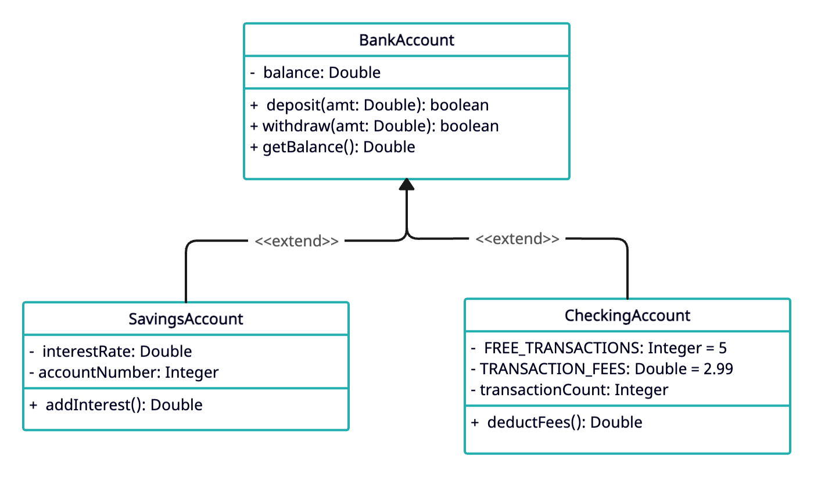

UML (Unified Modeling Language) class diagrams are a visual representation of the structure and relationships within a systems. They're commonly used in software engineering to design and understand object-oriented systems at design phase. UML diagrams in general can be used for multiple different purposes but this tutorial focuses only on UML class diagrams.
<!--more-->

## Basic Sections

A class diagram consists of classes, their attributes, and their relationships with other classes. The relationships are represented using different kinds of visual representations to distinguish different kinds of relationships. The main sections of UML class diagram include following. The class diagram for single class has three main sections.

- **Class Name:** The name of the class is written in the first compartment at the top of the class box.
- **Attributes:** This section lists the attributes or properties of the class, usually in a separate compartment within the class box.
- **Methods:** This section lists the methods or functions that the class can perform, also in a separate compartment within the class box.
- **Relationships:** These are depicted by lines connecting different classes and represent how classes are related to each other. The type of relationship and multiplicity may be indicated on these lines.

In above diagram, it represents relationship between a class `Person` and `Address`. The first section in each of them is the class name, second section represents attributes or data members of a class and the last compartment shows the methods in the class. This diagram also shows that the `address` attribute in `Person` class is of type `Address` by using a line between attribute and the class. In this case, it's aggregation relationship, but I will explain relationships in a minute.

## Access Modifiers

Note the plus sign (`+`) before each attributes and methods. This is used to denote the access modifiers of the attribute or methods.

| Symbol            | Access Modifier   |
|:------------------|:------------------|
| `+`               | public            |
| `-`               | private           |
| `#`               | protected         |
| `~`               | package           |
| underlined or `$` | static            |

## Relationships between classes

In UML diagram, we use different arrows and notations to represent relationship between two classes or two objects.

### Inheritance (Generalization): 
Inheritance denotes an "is-a" relationship where one class inherits attributes and methods from another class. For example, `Account` can be an abstract class and from this, we can have derived classes like `SavingsAccount` or `CurrentAccount`.

In the UML diagram below, we have `BankAccount` as the parent class and child classes `SavingsAccount` and `CheckingAccount` inherits from this account. This allows code reuse from the parent class `BankAccount`. All the common functionalities are defined in the generic `BankAccount` class. I have repesented `balance` as `Double` type but in practice, `Double` type may not be suitable to represent financial values.

To represent implements relationship, the arrow is drawn using dashed lines instead of solid line. 

For abstract classes, on the other hand, the class itself is either denoted as `abstract` or it is written in *italic* font.

### Association: 
This is a basic relationship where one class is connected to another. It represents how objects from different classes are connected and interact with each other. That doesn't mean it cannot exist in another class. For example, in Java collections, `HashMap` can exist in multiple different classes. So, it is an association relationship. It is not a "part of" relationship, but it is more like "uses" relationship

### Aggregation: 
Aggregation represents a "whole-part" relationship, where one class is a part of another class but can exist independently as well. It's denoted by a diamond shape on the container end of the relationship line. Again, this is not a strong relationship where the lifecycle of the contained object is dependent on the container object. For example, a `University` might consist of `Student`, `Teacher` and other `StaffMember`s. All of them can exist independent of the `University` but in the context of system design, they are in the `University` with aggregation relationship. The contained object can still live outside or without the container object.

### Composition: 
Similar to aggregation, composition also depicts a "whole-part" relationship, but with stronger ownership, meaning the part cannot exist without the whole. The contained object can never escape the owner (container) object. In UML diagrams, it’s represented by a filled diamond shape on the container end of the line.

### Realization (or Dependency): 
Realization signifies that one class implements an interface provided by another class.
