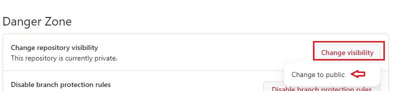

Hugo is one of the most popular frameworks for creating JAM stack websites easily. It is powering thousands of websites as well as complex applications at the moment. Due to its high performance, it is almost overtaking wordpress deployments. This blog post explains how you can deploy a simple Hugo website using Github Actions and Github pages for free.

<!--more-->

## Hugo Overview
Hugo is a highly popular open-source static site generator (SSG) designed to create fast and flexible websites. Developed in the Go programming language, Hugo aims to simplify the process of building static websites by allowing developers to generate web pages from simple text files.

Unlike traditional content management systems (CMS) that dynamically render web content on each request, Hugo generates static HTML files during the build process. This makes the resulting website extremely fast, secure, and easy to host on any web server or content delivery network (CDN). It offers support for multi-language sites, powerful templating with reusable components, live-reloading for instant previews during development, and a vast ecosystem of themes and plugins created by a vibrant community.

Whether you're building a personal blog, documentation site, portfolio, or e-commerce store, Hugo provides an efficient and scalable solution for generating static websites that are both visually appealing and performant.

## Setup Project Directory

Let's set up our project repository.

### Prerequisites

1. Hugo website
2. Git

This post assumes that you already have a Hugo website ready to deploy.

If you're using Github for your repository hosting, you can create a repository with name `<username>.github.io`. This is special name that Github pages use to host your website. This repo will be accessible at the URL `https://<username>.github.io` once it's deployed. Go inside your Hugo website directory and follow below commands to set up your Github repo.

```bash {.show-prompt-all lineNos=false }
git init
git remote add origin git@github.com:<username>/<repo-name>
git add .
git commit -m "Initial Hugo website"
git push origin master
```

With above setup done, you should have a repository with name `<username>.github.io` in your Github account.

In your Github account, for the repository, change the visibility to public repository if it's not public.
Go to Seetings > Danger Zone > Change Visiblity > Change to public




Also change the Page source by going to "Settings > Pages" and set the "Source" to "Github Actions".


## What is Github Actions?

GitHub Actions is a flexible automation framework built into the GitHub platform that allows you to define custom workflows for your software projects. With this feature, developers can automate common tasks, build, test, and deploy their applications directly from their GitHub repositories. It empowers developers to create complex workflow pipelines without relying on external tools or services.

### Building Blocks:

1. **Workflow:**
A workflow represents an automated process consisting of one or more jobs performed on specific events or triggers. Workflows are defined using YAML files and can be customized to suit your project's needs.

2. **Jobs:**
Jobs are units of work within a workflow that run in parallel by default and define the sequence of steps required to accomplish a specific task. Each job runs on its own virtual environment (runner) and can include multiple steps.

3. **Steps:**
Steps are the individual actions that make up a job. They represent tasks like building, testing, deploying, or sending notifications. You can use both built-in actions provided by GitHub or create your own custom actions for specific requirements.

4. **Actions:**
Actions are reusable building blocks used within workflows to perform various tasks within your development process. You can leverage pre-built actions from the GitHub Marketplace, community-maintained repositories, or create your own custom actions.

Create a file `.github/workflows/github-pages.yml` in your repository.

We first specify the general syntax for Github actions. These at least includes `name` and we also provided some default.

```yaml
name: Build & Deploy Site
defaults:
  run:
    shell: bash
```

Next, specify when the workflow should run.

```yaml
on:
  workflow_dispatch:
  push:
    branches:
      - main
```

At high level, we have two jobs. One for setting up hugo and building the website and another for deploying the website to Github pages.

```yaml
jobs:
######################################################################
# build & deploy the site
######################################################################
  build:
    name: Build and deploy
    if: "!contains(github.event.head_commit.message,'[skip-ci]')"
    runs-on: ubuntu-latest
    ... ...
    ... ...
  # Deployment job
  deploy:
    environment:
      name: github-pages
      url: ${{ steps.deployment.outputs.page_url }}
    runs-on: ubuntu-latest
    needs: build
    ... ...
    ... ...
```

In above code, we specify that both steps run on `ubuntu-latest` using `runs-on` and the second job `deploy` depends on `build` job using `needs: build`.
Let's go deeper into each job in detail.
The `build` job has several steps which include checking out repository, downloading and installing hugo on our pipeline runner instance. Next we install `dart-sass` so that we can process sass files. We set up Github Pages, build the website using `hugo` command and upload the artifacts from `./public` directory for Github pages.

```yaml
  build:
    name: Build and deploy
    if: "!contains(github.event.head_commit.message,'[skip-ci]')"
    runs-on: ubuntu-latest
    steps:
      - name: Checkout repo codebase
        uses: actions/checkout@v3
        with:
          submodules: recursive
          fetch-depth: 0
      - name: Download Hugo v${{ env.HUGO_VERSION }} and Install
        env:
          HUGO_VERSION: 0.115.3
        run: |
          wget -O ${{ runner.temp }}/hugo.deb https://github.com/gohugoio/hugo/releases/download/v${HUGO_VERSION}/hugo_extended_${HUGO_VERSION}_linux-amd64.deb \
          && sudo dpkg -i ${{ runner.temp }}/hugo.deb
      - name: Install Dart Sass
        run: sudo snap install dart-sass
      - name: Setup Pages
        id: pages
        uses: actions/configure-pages@v3
      - name: Build with Hugo
        env:
          # For maximum backward compatibility with Hugo modules
          HUGO_ENVIRONMENT: production
          HUGO_ENV: production
        run: |
          hugo \
            --gc \
            --minify \
            --baseURL "${{ steps.pages.outputs.base_url }}/"          
      - name: Upload artifact
        uses: actions/upload-pages-artifact@v1
        with:
          path: ./public
```

Next, the `deploy` job includes deploying the website to Github pages.

```yaml
  deploy:
    environment:
      name: github-pages
      url: ${{ steps.deployment.outputs.page_url }}
    runs-on: ubuntu-latest
    needs: build
    steps:
      - name: Deploy to GitHub Pages
        id: deployment
        uses: actions/deploy-pages@v2
```

The complete file looks like below.

```yaml
name: Build & Deploy Site
defaults:
  run:
    shell: bash
# When the action should run?
# Here, we specify workflow should run on push to main branch
# We also specified it to run manually with empty "workflow_dispatch"
on:
  workflow_dispatch:
  push:
    branches:
      - main

# Sets permissions of the GITHUB_TOKEN to allow deployment to GitHub Pages
permissions:
  contents: read
  pages: write
  id-token: write
# Allow only one concurrent deployment, skipping runs queued between the run in-progress and latest queued.
# However, do NOT cancel in-progress runs as we want to allow these production deployments to complete.
concurrency:
  group: "pages"
  cancel-in-progress: false


jobs:
######################################################################
# build & deploy the site
######################################################################
  build:
    name: Build and deploy
    if: "!contains(github.event.head_commit.message,'[skip-ci]')"
    runs-on: ubuntu-latest
    steps:
      ######################################################################
      # checkout full codebase
      ######################################################################
      - name: Checkout repo codebase
        uses: actions/checkout@v3
        with:
          submodules: recursive
          fetch-depth: 0
      ######################################################################
      # download & install Hugo (line break added in URL for readability)
      ######################################################################
      - name: Download Hugo v${{ env.HUGO_VERSION }} and Install
        env:
          HUGO_VERSION: 0.115.3
        run: |
          wget -O ${{ runner.temp }}/hugo.deb https://github.com/gohugoio/hugo/releases/download/v${HUGO_VERSION}/hugo_extended_${HUGO_VERSION}_linux-amd64.deb \
          && sudo dpkg -i ${{ runner.temp }}/hugo.deb
      - name: Install Dart Sass
        run: sudo snap install dart-sass
      - name: Setup Pages
        id: pages
        uses: actions/configure-pages@v3
      - name: Build with Hugo
        env:
          # For maximum backward compatibility with Hugo modules
          HUGO_ENVIRONMENT: production
          HUGO_ENV: production
        run: |
          hugo \
            --gc \
            --minify \
            --baseURL "${{ steps.pages.outputs.base_url }}/"          
      - name: Upload artifact
        uses: actions/upload-pages-artifact@v1
        with:
          path: ./public

  # Deployment job
  deploy:
    environment:
      name: github-pages
      url: ${{ steps.deployment.outputs.page_url }}
    runs-on: ubuntu-latest
    needs: build
    steps:
      - name: Deploy to GitHub Pages
        id: deployment
        uses: actions/deploy-pages@v2
```

