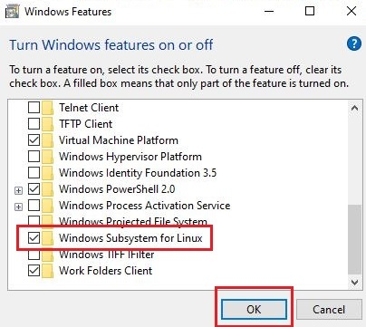

WSL2 (Windows Subsystem for Linux 2) is a powerful feature introduced by Microsoft that enables developers to run a full Linux environment directly on their Windows machines. It provides seamless integration between Windows and Linux, allowing you to leverage the benefits of both operating systems. In this blog post, we will walk you through the step-by-step process of installing WSL2 on your Windows system.
<!--more-->

## Prerequisites
Before we begin, please ensure that you meet the following prerequisites:
- Windows 10 version 2004 or higher.
- A system with virtualization capabilities enabled in the BIOS settings.

Now, let's go into the installation process.

## 1: Enable WSL Feature
1. Open **Control Panel** from the Start menu.
2. Click on **Programs**.
3. Under **"Programs and Features"**, click on "Turn Windows features on or off".
4. Scroll down and locate **"Windows Subsystem for Linux"**.
5. Check the box next to it and click OK.
6. Restart your computer when prompted.



## Step 2: Update to WSL2
By default, WSL installs as version 1 (WSL1). To upgrade to WSL2:
1. Open PowerShell as an administrator.
2. Run the following command:

```powershell{lineNos=false}
wsl --set-version <distribution name> 2
```
Replace `<distribution name>` with the name of your installed Linux distribution (e.g., Ubuntu).

3. Wait for the conversion process to complete.

## Step 3: Install a Linux Distribution from Microsoft Store

1. Open **Microsoft Store** from the Start menu.
2. Search for and select a preferred Linux distribution such as Ubuntu, Debian, or Fedora.
3. Click on **"Get"** or **"Install"** button to start downloading and installing the distribution.

## Step 4: Initialize and Configure Your Linux Distribution
1. Launch the installed Linux distribution from the Start menu or by typing its name in the search bar.
2. Wait for the initialization process to complete. It might take a few minutes if it's your first time using WSL2.
3. Set up a new `username` and `password` for your Linux environment. The password will be something you will need for downloading and installing software as root. So, keep this in mind.

Congratulations! You now have WSL2 successfully installed on your Windows system.

## Optional: Customizing Your WSL Experience
WSL2 provides various customization options to enhance your development experience.
- To change the default version of WSL used for new distributions, run `wsl --set-default-version 2` in PowerShell as an administrator.
- To access WSL file system from File Explorer, navigate to `\\wsl$\` in the address bar.

## Conclusion
In this blog post, we walked through a detailed step-by-step guide on installing WSL2 on Windows. With WSL2, you can seamlessly run Linux distributions directly within Windows, enabling you to leverage both ecosystems simultaneously. Now that you have WSL2 up and running, you can start utilizing the vast range of tools and frameworks available in the Linux environment right from your Windows machine.