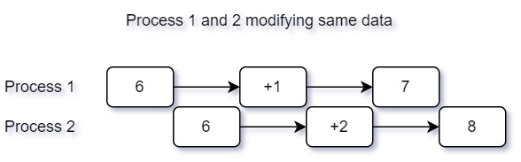

This tutorial provides concurrency overview and explains the difference between concurrency and parallelism. Although these terms sound very similar and many people think of them as the same thing, but in reality, it's not.

<!--more-->

Sequential programming is simple. Commands are executed one after another in linear fashion. Then comes multi-tasking where multiple tasks are executed. This is still single-core processor with context switching to allocate few CPU seconds to each task . Concurrency is like running multiple tasks at the same time. Concurrent programming is not same as parallel programming.

In the past, computers had single processor and programs were written to run in serial manner. This led to limitations as the computer programs became increasingly complex. The larger the program, the longer it would take to execute. Multiple proceses running on the same processor is called multi-programming. In this, we have single cprocessor. So, we have to relieve the CPU for other processes during execution. Similarly, multiple processes running on multiple processors is called multi-processing.

## Concurrency
Concurrency in Golang refers to managing multiple tasks at the same time. It doesn't necessarily mean those tasks are being run at exactly the same nanosecond. For instance, one task could be waiting for an input while another is performing computation. Gazillions of things seem to be happening simultaneously in concurrent environments but that's not entirely true; there's a bit of start-stop-start dance going on behind the scenes! This is called CPU context switching where it performs some task for few seconds before stopping its execution and moving over to another task. Concurrency shines when dealing with a lot of tasks with unknown durations such as reading or writing to a disk, where we can start another task instead of waiting for one to finish. Concurrency is easy to manage when tasks are independent of each other and do not access same resource on the computer. However, in practice, most computer processes share and complete for the same resources.

### Problems with Concurrency

Let's say we have a global data variable of integer with value 10 and two processes try to access this data at the same. These both processes modify the data at the same time using increment operation. One process increments it by 1 making it 7 and another process increments it by 2 making it 8. In reality, it should have the value of 9, but due to this concurrent nature of processes accessing same data, we have incorrect value for that data.



In order to avoid this, we can put a lock on the data. Only one process can access this variable at a time. This is called *mutual exclusion*. If one process has acquired a lock on a data, other process will have to wait until that lock is released by first process. Once that's released, only then second process can access this data. However, this leads to even further problems as mentioned below.

1. Race Conditions: This occurs when two concurrent threads access shared data and try to change it simultaneously, leading to unpredictable outcomes.

2. Deadlocks: This situation arises when two or more tasks permanently block each other by each task waiting for the other to give up a resource.

3. Starvation: It's a situation where a process is perpetually denied necessary resources, preventing it from completing its task.

4. Livelock: Similar to deadlock, but the tasks are not blocked - they keep changing their state in response to others without making progress.

5. Contention: Two or more operations are bottlenecked because they require access to shared resource resulting in slower system performance.

6. Complexity: Concurrency adds another layer of complexity where errors are harder to reproduce and correct since the behavior may not be deterministic.

So, in general, developing concurrent programs is very difficult.

## Parallelism
Parallelism, however, means running multiple tasks at literally the same instant. It involves splitting a single task into discrete functions that can run concurrently on different processors or cores on your machine. It assumes that the tasks are independent of one another. Hence, parallelism is about increasing speed by doing more than one thing at an exact moment - it boosts CPU usage significantly for computation heavy tasks. Modern day computers have multiple CPUs, so they can be used to perform parallel operations.

While all parallelism is concurrent by nature (because each discrete function happens 'independently' and simultaneously), not all concurrent systems are running in parallel because under the hood, there might be only single task being executed while another task is waiting. CPUs these days are so fast that we never realize this kind of task switching. In parallel computing, there are separate processors working on tasks simultaneously but they are working independent of one another.

Sequential programming is simple to implement. Commands are executed one after another in linear fashion. 
To illustrate this concept practically, below code is sequential program example. In this program, we iterate through first 100 numbers and calculate their square while also waiting for 1 second each time. So, in normal sequential execution it would take around 100 seconds in total. If we execute this code, you can see this takes around 100 seconds.

Something new in this code is that we use `time` package to sleep 1 second in each iteration using `time.Sleep(1 * time.Second)`.

```go
package main

import (
	"fmt"
	"time"
)

func main() {
	start := time.Now()
	for i := 1; i <= 100; i++ {
		printSequence(i)
	}
	elapsed := time.Since(start)
	fmt.Println("Elapsed time", elapsed)
}

func printSequence(i int) {
	time.Sleep(1 * time.Second)
	fmt.Println("Sequence", i)
}
```

This program runs sequentially that's why it takes around 100 seconds. Go provides easy and convenient way to create concurrent programs using Go routines. They are the building blocks for making code run in parallel which we will see in the next lesson.