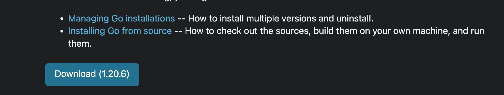

This tutorial talks about **how to install Go compiler** in your machine to start learning coding in Golang.
<!--more-->

## Set up Go in your System

Installing Go is quite straight forward. Just navigate to [this page](https://go.dev/doc/install) and it will guide you through the installation for specific operating system. On this page, click on the Download button as shown in the below image.



This takes us to respective version download for different operating system. Depending on your OS, you can choose one of the ways to download the binaries. It also has default windows installers which you can find with extension `.msi` and similarly for MacOS, it has `.pkg` files which are easily extracted to install it. If you need to install any other version, you can also do so by choosing earlier versions.

For Ubuntu or UNIX based systems we can install them by following below commands.

```shell{.show-prompt-all lineNos=false}
sudo tar -C /usr/local -xzf go1.12.6.linux-amd64.tar.gz
tar -xzf go*.tar.gz
sudo cp -r go /usr/local/
```

Once Go is installed, you can verify the installation by typing `go version` on your terminal or command prompt. This should show the installed version of Go binaries.

```bash{ .show-prompt lineNos=false }
go version
go version go1.20.2 darwin/arm64
```

## Go Command line tool

While we are at it, let's play with the command line tool to get little bit of idea about all the options. I will mention only some of the most common options, but you can always get information about specific go command using `go help` and it will list all commands available with Go command line tool. This help is context aware, so if we need more information on `go run` command, we can type `go help run`. This will show a detailed description of this command.

Let's learn about few of the Go commands. While running them, make sure to prefix them with `go`.

| Go Command | Description |
|:--------|:------------|
| install | This is used to compile and install packages and dependencies |
| list | List Packages and modules |
| run | Compile and run Go program. We will be using this option quite a lot in this tutorial to execute our Go code. |
| test | Used to test packages |
| build | Compile packages and dependencies |
| version | Prints Go version |


