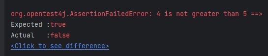

JUnit provides various assertions to test out different conditions. The most common ones are `assertEquals`, `assertThat` and `assertTrue`, but there are some variations of them which we will cover in this tutorial.
<!--more-->

## Introduction
In JUnit 5, we have `org.junit.jupiter.api.Assertions` class which provides various static methods used to assert or verify certain conditions in JUnit tests. The common syntax for assertions will look like below.

```java
assertionMethod(String expectedValue, String actualValue)
```

These methods are heavily overloaded and can work on various data types and they also have optional third parameter of `message` which can be displayed if the assertion does not succeed.

## Available Assertions

*Below* are the most common assertions we can use.

- **assertEquals(expected, actual, message)**

    This assertion verifies that expected and actual values are equal. This can be applied on all primitives including String data types.
- **assertTrue(boolean condition)**

    This asserts that the supplied boolean condition is `true`.
- **assertFalse(boolean condition)**

    This asserts that the supplied boolean condition is `false`.
- **assertNull(Object actual)**

    Assert that `actual` object is `null`.
- **assertNotNull(Object actual)**

    Assert that `actual` is not `null`.

- **assertSame(obj1, obj2)**

    asserts whether two objects `obj1` and `obj2` are exactly same instance in memory. These objects can be of any type.

- **assertThrows(exception, executable)**

    asserts that the second argument execution results in exception of class specified by first argument. The second argument has to be executable code, usually lambda expression involving method under test.

- **assertDoesNotThrows(executable)**

    asserts that the execution of `executable` does not result in exception.

- **assertNotSame(obj1, obj2)**

    asserts whether two objects are not exactly same in memory.
- **assertArrayEquals(expected, actual)**

    asserts that the `actual` array is equal to `expected` array. This checks for array elements in the same order.

## Practical Examples

Let's see some examples of these. Although I have hardcoded values `actual` values, you can assume those values coming from some function.

Just for demonstration, I have defined this source class as one of the example.

```java
public class Assertion {
    public static boolean greaterThanFive(int value) {
        return value > 5;
    }

    public static int divide(int num1, int num2) {
        return num1 / num2;
    }
}
```

The test class has the corresponding methods to test boolean values.

```java
public class AssertionTest {
    @Test
    void testBooleans() {
        assertTrue(true);
        assertFalse(false);
        int value = 6;
        assertTrue(Assertion.greaterThanFive(value), String.format("%d is not greater than 5", value));
        assertTrue("bar".equals("bar")); // not ideal, use assertEquals
    }
}
```

As you can see on line 7, I have added one extra parameter of custom message which gets displayed when the test case fails. For example, if I modify `value` to be `4` and execute this test, I get below message.



Below is a complete code for this class, which has methods for testing various data types with above assertions.

```java
import org.junit.jupiter.api.Test;

import static org.junit.jupiter.api.Assertions.*;

public class AssertionTest {
    @Test
    void testBooleans() {
        assertTrue(true);
        assertFalse(false);
        int value = 4;
        assertTrue(Assertion.greaterThanFive(value), String.format("%d is not greater than 5", value));
        assertTrue("bar".equals("bar")); // not ideal, use assertEquals
    }

    @Test
    void testStrings() {
        assertEquals("foo", "foo");
        assertNotEquals("foo", "bar");
        assertSame("foo", "foo");
    }

    @Test
    void testPrimitives() {
        assertEquals(1, 1);
        assertEquals(1.2, 1.2);
        assertEquals(1, 1.0);
        assertNotEquals(1.0, 0.99);
        assertEquals('a', 'a');
        assertNotEquals('a', 'A');
        assertEquals('a', 97);
    }

    @Test
    void testNull() {
        assertNull(null);
        assertNotNull(new String("Hello"));
    }

    @Test
    void testArrays() {
        int[] nums = {1,2,3};
        int[] nums2 = {1,2,3};
        assertArrayEquals(nums, nums2);
        assertNotSame(nums, nums2); // not same object
        nums2 = new int[]{2,3,1};
//        assertArrayEquals(nums, nums2); // fails
    }

    @Test
    void testThrows() {
        assertThrows(ArithmeticException.class, () -> Assertion.divide(2,0));
        assertDoesNotThrow(() -> Assertion.divide(4,2));
    }
}
```

### Not implemented Tests

This is all good, but what if we have not yet implemented a testcase and want to be reminded of that before we merge it. If we have a feature that we are planning to add or something that we have added but we have not written a unit test, then we can write a skeleton of the method we want to test and inside the method, we can make the unit test fail using `fail()` method as shown in example below. Ideally in TDD, it's standard practice to first write unit test before implementing any feature, but in case you may see this kind of requirement.

```java
    @Test
    void futureFeature() {
        fail("Not implemented");
    }
```