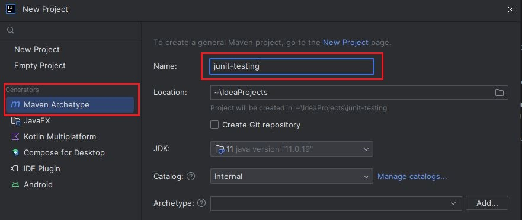
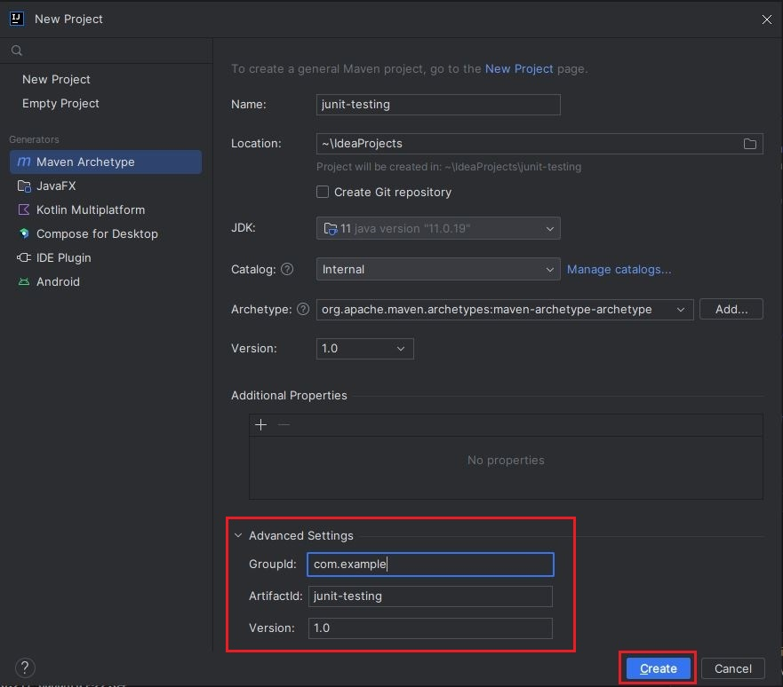
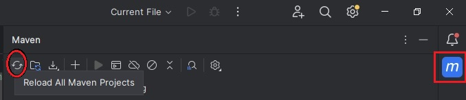
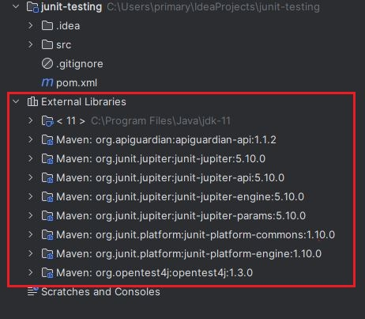

In this tutorial, we are downloading and installing required softwares and tools. We will also start the project and set up for JUnit testing.
<!--more-->

First of all, we need to install Java and development IDE to work with Java easily. For this tutorial, I am using Java 11. However, you use latest version of Java. It should most likely be backward compatible.

1. Download and install JDK. There are several Java Development Kit (JDK) available online. You can use Oracle JDK or OpenJDK published by major companies. Please, note that you need to install JDK and not JRE.
2. Install IntelliJ IDEA. This is Integrated Development Environment (IDE) for Java development. This is published by company Jetbrains and they have free Community version which you can download for free. Visit [Jetbrains website](https://www.jetbrains.com/idea/download) and download IntelliJ IDEA Community Edition for your respective operating system.

Once these tools are installed, you can verify installation by opening terminal and typing `java -version` and it should return output with Java version installed in your system.

## Creating new Maven Project

1. One you've launched IntelliJ IDEA, you can click **New Project** to create brand new project.


2. On the next screen, make sure "Maven Archetype" is selected and give your project a name. In this screenshot, I have named it **junit-testing**. In the second box, Location, you can change the location where you want to store this project in your system. For JDK, as you can see, I have selected Java 11.



3. In the middle section, select Maven Archetype and type `org.apache.maven.archetypes:maven-archetype-archetype` in this field. Towards, bottom click on **Advanced Settings** and provide groupId as `com.example`. This is like reverse domain name, so if you have any domain registered for yourself, you can use it in reverse order. For groupId, you can put `junit-testing` and for version modify it to 1.0.



4. Next click **Create** button.

Above steps will create basic skeleton project for Maven. The root directory the project contains `pom.xml` this is the file where we can specify the dependencies that our project depends on. In this case, specifically, we will need junit dependency. Currently, our project directory has below files and directories.

```shell{ .show-prompt lineNos=false }
tree
├── pom.xml                          
└── src                              
    └── main                         
        └── resources                
            ├── META-INF             
            │   └── maven            
            │       └── archetype.xml
            └── archetype-resources  
                ├── pom.xml          
                └── src
                    ├── main
                    │   └── java
                    │       └── App.java
                    └── test
                        └── java
                            └── AppTest.java
```

Now, we have basic directory structure setup for Maven project. Remove the `App.java` file in `src/main/java` and `AppTest.java` in `src/test/java` directory respectively. We will write our own unit test and application code.

## Adding JUnit Dependency

Next, we need to add JUnit dependency so that we can use it for our Unit testing. In this case, for maven, we can find the dependecy from [Maven Repository](https://mvnrepository.com/).

Search for `junit-jupiter`, you will find several dependencies in maven. We just have to add `junit-jupiter`  which is also referred to as Junit Jupiter (Aggregator) because it combines all JUnit dependencies. So, we don't have to include each one explicitly.

In my case, I will add dependency like below in my `pom.xml` file.

```xml
<dependencies>
    <dependency>
        <groupId>org.junit.jupiter</groupId>
        <artifactId>junit-jupiter</artifactId>
        <version>5.10.0</version>
        <scope>test</scope>
    </dependency>
</dependencies>
```

At this point, we can reimport new dependencies in our POM file using Maven icon on the right side of your IDE. Click on Maven icon on the right panel and click "Reload all Maven Projects" icon as shown below.



This will download all Maven packages under External Libraries in the project navigation menu on the right hand side.




With this, maven resolves depdendencies for JUnit. The next steps are to have some application code and we are ready to write our first unit tests.