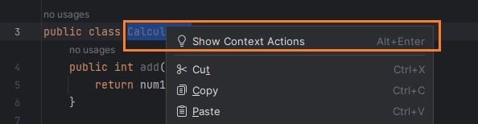
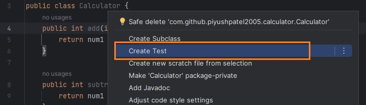

In this tutorial, we will write our first test cases. We are going to write `Calculator` class which will try to test using JUnit.
<!--more-->

## Overview

Let's first write the application code. In this case, I have a Calculator application which has `Calculator` class as shown below.


```java
public class Calculator {
    public int add(int num1, int num2) {
        return num1 + num2;
    }

    public int subtract(int num1, int num2) {
        return num1 - num2;
    }

    public int multiply(int num1, int num2) {
        return num1 * num2;
    }

    public int divide(int num1, int num2) {
        return num1 / num2;
    }
}
```

In this Java file select class name and right-click, select "Show Context Actions".



Next, click "Create Test".



This will create `CalculatorTest` class in `src/test/java` directory under the same package as the original application class `Calculator`.