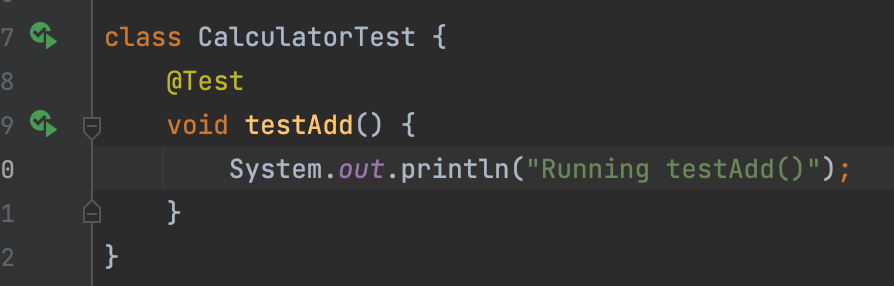
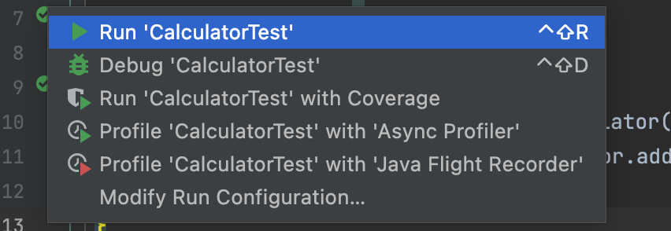
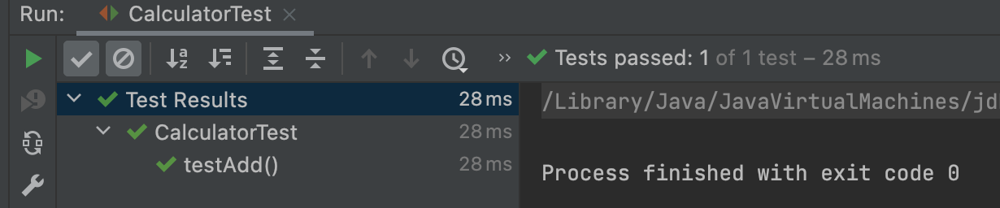
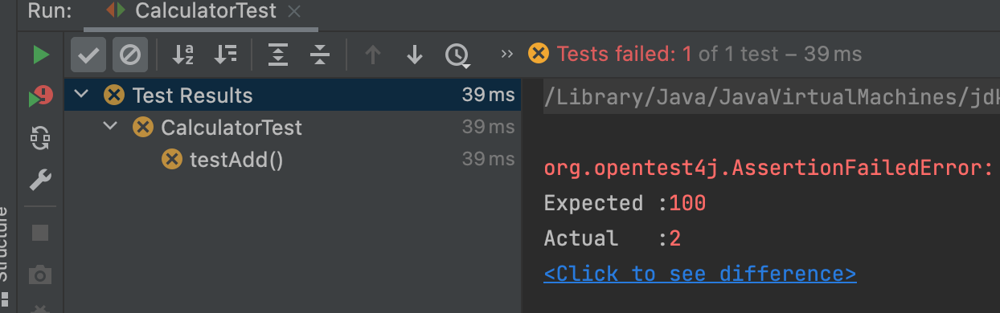
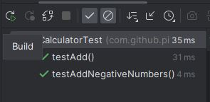
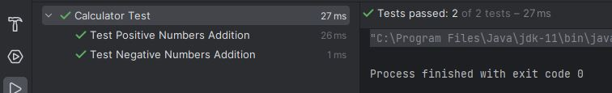

In this tutorial, we will write our first test cases. We are going to write `Calculator` class which will try to test using JUnit.
<!--more-->

## Overview

Let's first write the application code. In this case, I have a Calculator application which has `Calculator` class as shown below.


```java
public class Calculator {
    public int add(int num1, int num2) {
        return num1 + num2;
    }

    public int subtract(int num1, int num2) {
        return num1 - num2;
    }

    public int multiply(int num1, int num2) {
        return num1 * num2;
    }

    public int divide(int num1, int num2) {
        return num1 / num2;
    }
}
```

## Creating your First Test

In this Java file select class name and right-click, select "Show Context Actions".


Next, click "Create Test".


This will create `CalculatorTest` class in `src/test/java` directory under the same package as the original application class `Calculator`.
Currently, it looks like this.

```java
class CalculatorTest {

}
```

## Running Your First JUnit Test

Now, we will test one method at a time from our `Calculator` class. In JUnit, every test method needs to have `@Test` annotation. So, we will write our method like below.

```java
import org.junit.jupiter.api.Test;

class CalculatorTest {
    @Test
    void testAdd() {
        System.out.println("Running testAdd");
    }
}
```




After adding this code, you will see two green buttons on the left side of class declaration and the method. The first one allows to run whole CalculatorTest class which at the moment includes only one test method as shown on line 5 above. The second one allows to run specific method in case we want to check only one method and nothing else. In this case, we have only added print message but still the test case passes which is wrong, but you can see that when we run the test case, it will print the output on the console like any other method in Java.

Let's add some valid test cases. Modify this code file like below. 

```java
import org.junit.jupiter.api.Test;

import static org.junit.jupiter.api.Assertions.assertEquals;

class CalculatorTest {
    @Test
    void testAdd() {
        Calculator calculator = new Calculator();
        assertEquals(2, calculator.add(1, 1));
    }
}
```

In this method, we first create `Calculator` instance so that we can invoke the method `add()` on that instance. The next line has one assertion on line 9. We will learn more about assertions in upcoming lesson, but for now think of them as validating statement which validates that the output of `add` function is what we expected. In this case `1 + 1 = 2`. The method signature is like `assertEquals(Long expected, Long actual)`. In this case the second argument is the thing we want to validate and the first argument is what we expect the output to be.

Also important to note that the class and method does not have access modifier. This is because they should be run as individual files and we can ignore access modifiers for Test files.

When we run this code, we get green output. 



Let's make this test fail and see what it gives. Let's change the expected value to be 100.

```java
class CalculatorTest {
    @Test
    void testAdd() {
        Calculator calculator = new Calculator();
        assertEquals(100, calculator.add(1, 1));
    }
}
```

In this case, the tests fail and we get red output.



Along with failed tests, the console gives the output why it failed.

```output{ lineNos=false }
org.opentest4j.AssertionFailedError: 
Expected :100
Actual   :2
```

This was the very basic test case. The passed tests do not mean our code is correct but it gives us a way to validate our methods. We may have to add than one assertions in single test method.

## `DisplayName` annotation

Now, at the moment, it shows somewhat unusual description of methods. What if we had two different methods for testing `add()` functionality of the `CalculatorTest`. In this case, two methods will have different names but still it will be hard to read. Check below example with two methods.

```java
import org.junit.jupiter.api.Test;

import static org.junit.jupiter.api.Assertions.*;

class CalculatorTest {
    @Test
    void testAdd() {
        Calculator calculator = new Calculator();
        assertEquals(2, calculator.add(1, 1));
    }

    @Test
    void testAddNegativeNumbers() {
        Calculator calculator = new Calculator();
        assertEquals(-5, calculator.add(-2, -3));
    }
}
```

Again as previous method, we need to annotate the method with `@Test` which will mark the method as JUnit test method. When we run this method, it shows output like below.



In this case, it's unclear exactly what these methods are testing. So, some developers use long naming conventions. That convention may use camel-case notation or some other notation like below.

```java
void testPositiveAddition_WhenBothNumbersPositive_ShouldReturnCorrectResult() {

}

void testNegativeAddition_WhenBothNumbersNegative_ShouldReturnCorrectResult() {

}
```

Although this gives slightly more idea on what method does, it is still hard to read. To solve this, we can use `@DisplayName` annotation on test classes and test methods. This gives us better idea on what each method does or which method failed.

```java
import org.junit.jupiter.api.DisplayName;
import org.junit.jupiter.api.Test;

import static org.junit.jupiter.api.Assertions.*;

@DisplayName("Calculator Test")
class CalculatorTest {
    @Test
    @DisplayName("Test Positive Numbers Addition")
    void testAdd() {
        Calculator calculator = new Calculator();
        assertEquals(2, calculator.add(1, 1));
    }

    @Test
    @DisplayName("Test Negative Numbers Addition")
    void testAddNegativeNumbers() {
        Calculator calculator = new Calculator();
        assertEquals(-5, calculator.add(-2, -3));
    }
}
```

In above code, we have added `@DisplayName` to the test class and both test methods. Now, if we execute the test class, we see output like this.



This annotation makes it easier to read test results. This can be very useful when we have hundreds of test cases and we have to read which ones failed.
