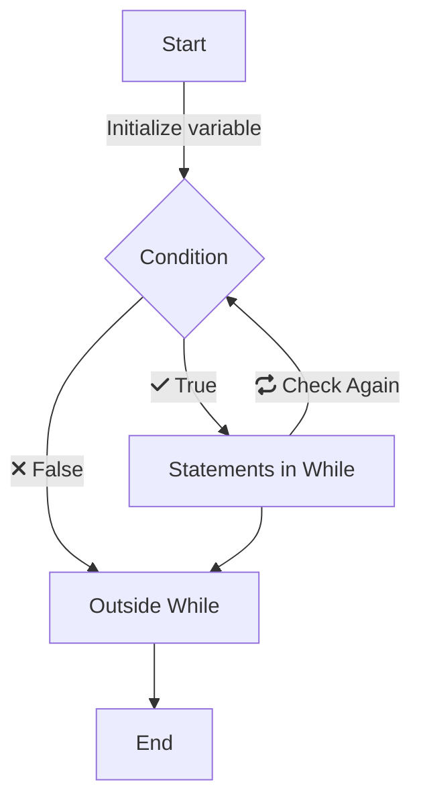

There are situations in programming when you want to repeat some tasks. In this condition, although we can write the same statements multiple times, this is better managed using loops. **Loops** are basically a mechanism to repeat certain statements multiple times.
<!--more-->

# Overview

In Python, we mainly have two types of loops. 
1. While loop
2. For loop

Let's see some examples of these looping structures.

## While Loop

The syntax for while loop looks like this.

```python
# initialize counter
while condition:
    # ... ...
    # statements of while block
    # ... ...
    # Modify counter variable
```


flowchart TD
    A[Start] -->|Initialize variable| B{Condition Check}
    B -->|fa:fa-check True| C[Statements in While]
    C --> |fa:fa-repeat Check Again| B{Condition}
    B -->|fa:fa-xmark False| E[Outside While]
    C --> E[Outside While]
    E --> F[End]




First we initialize a variable which will be used for iterating in while loop. In the `while` statement, we check for a condition. If this condition holds `True`, we execute statements inside the `while` loop. At the end of the `while` block, we check for the condition again. When this condition check becomes `False`, the execution moves outside the `while` block.

```python
i = 0
while i < 5:
    print(i)
    i += 1
```
**Output**
```console{ lineNos=false }
0
1
2
3
4
```

There is one problem with `while` loop usually. If we forget to modify the counter variable inside the `while` block, this will result in **Infinite loop**. It will basically keep repeating indefinitely.

While loop is particularly useful when we do not know upfront how many times to iterate. For example, when we want to act based on user input, when user enters certain word, we want to quit, until then we want to keep repeating the statements of the `while` loop.

## For Loop

For loop is very convenient way to loop through any sequence. A simple `for..in` loop looks like this.

```python
for item in sequence:
    # for loop block
```

Let's take an example, where we iterate through each character of a word.

```python
str = 'Hello'
for character in str:
    print(character)
```

This will print all characters of a string "Hello".
**Output**
```output{ lineNos=false }
H
e
l
l
o
```

We will revisit this loop again when we learn about lists and other collection data types.

### Iterating using Range

If we want to iterate certain number of times to perform something, we can use `range` function. This returns immutable sequence using [Range](https://docs.python.org/3/library/stdtypes.html#typesseq-range) object. 
Range function takes three arguments `range(start, stop, step)`. 

```python
for number in range(0, 5):
    print(number)
```
**Output**
```output{ lineNos=false }
0
1
2
3
4
```

The default value for `start` is 0 and `step1` is 1. That's why we didn't have to specify `step`. Just like `step`, we can ignore `start`. Below code produces same output.

```python
for number in range(5):
    print(number)
```

We can also iterate through only odd numbers using `step` value of 2.

```python
for number in range(0, 10, 2):
    print(number)
```

We also have `else` block for both loops. This gets executed when the condition becomes `False` first time.

```python
for i in range(3,0,-1):
    print(i)
else:
    print("Go!")
```

**Output**
```console{ lineNos=false }
3
2
1
Go!
```

With For loop, we don't have to track the loop variable and hence we do not have to worry about infinite loops.