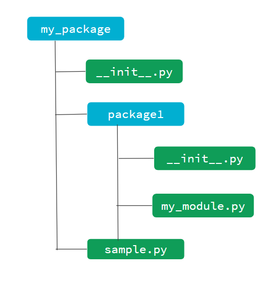

Python modules are code files which contains functions, classes and other constructs. Python packages, on the other hand, are collection of Python modules and serve specific purpose.

<!--more-->
## Overview

Modules and Packages are techniques to segregate our codebase into manageable pieces. Writing single huge monolithic file for our system may be very complicated and difficult to manage. So, we should try to minimize our code to manageable files.

Python modules and packages help with this. We name modules and packages in a sensible way so that they are easy to identify. In simple terms, modules are Python source files and packages are directories of Python source files.

## Modules

We create modules to arrange our code into manageable files. This makes it easy to manage our codebase. When we create a module file named `my_module.py`, that module can be referred using simply `my_module`. We don't need to write the file extension explicitly. Below is `my_module.py` file.

```python
# my_module.py
def add (num1, num2):
    return num1 + num2


def mul (num1, num2):
    return num1 * num2
```

We could import everything from this module using `import` statement like this.

```python
import my_module
```

Modules also helps with reusability. For example, if there was a generic function `sum` and if it was defined in a module, we could use it across multiple applications by importing that function from a module. Let's take a look at an example of this.

Above snippet imports all the constructs from `my_module` and makes them available. To access `add` function from this module, we can write `my_module.add()`.

```python
import my_module
print(my_module.add(2,3)) # 5
```

If the module name is very big and we want to avoid writing full module name, then we can also create an alias for that module name using `as` keyword.

```python
import my_module as my
print(my.add(2,3)) # 5
```

We can reference all the functions from the module using `module_name.function_name`, but cannot access the function directly. For example, we cannot call function like `function_name()`.

We could also import specific pieces from the module using `from module_name import something` syntax. In below code, I am importing `add` function explicitly. This makes the function available in the scope and I can use it even without prefixing it with the module name.

```python
from my_module import add
print(add(2,3)) # 5
```

If we want to import multiple items from the module, I can import them by separating each item using comma (`,`). This is also equivalent to importing everything from the file because in this case our module contains only these two functions. We can import everything from the module using following syntax.

```python
from my_module import *
print(add(2,3)) # 5
print(mul(2,3)) # 6
```

Here, we are importing everything from this module. This is dangerous and should not be used because it can cause name conflicts. This causes confusing situation when we have an `add` function from some other library and then we try to import add function from our module. This will override the functionality of earlier `add` function. This can cause bugs which are very hard to debug. So, always avoid importing using `import *`.

We can also rename each item from the module explicitly to avoid name conflicts.

```python
from my_module import add as my_add, mul as my_mul
print(my_add(1,2)) # 3
```

Python also provides many of the built-in modules. **Math module** is one of the most useful one. Let's take a look at some of the useful functions from math module. `ceil` function ceils a number to higher integer number, `floor` function floors a decimal number to lower number. `sqrt` function can be used to find square root of a number.

```python
import math
print(math.e) # 2.718281828459045
print(math.pi) # 3.141592653589793
print(math.ceil(3.2)) # 4
print(math.floor(3.8)) # 3
print(math.sqrt(9)) # 3.0
```

## Packages

Packages are like folders which contain different modules. This literally means a folder of Python code files. This provides higher level of code organization.

The package must have `__init__.py` file in them to make them module.



From above directory structure, we have two packages, one top level package `my_package` and one package inside this one, `package1`. Each package will have its own `__init__.py` file in them. This file may sometimes include some startup code for initialization.

Let's suppose `sample.py` module includes a function `greet()`, then we can import that function using `from my_package.sample import greet`. similarly, we can import `my_module` using `import my_package.package1.my_module as module1` or specific functions using `from my_package.package1.my_module import add`.