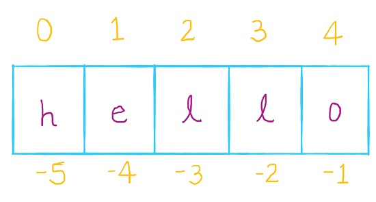

We have seen string data type, but in this lesson, let's learn about how to manipulate string using various available methods and also learn about substring extraction using string slicing.
<!--more-->

## Overview

When working with textual data, we will be performing various common operations like making text uppercase or lowercase, checking if a substring exists in full text, extracting part of the string, etc. Most of these operations are built-in the `str` data type. 

## Creating strings

We have seen that we can create string using either single quote or double quote. We can also use triple quotes like below.

```python
str1 = 'Hello'
str2 = "Hi"
str3 = '''Hello there'''
str4 = """Hi there"""
```

We can also create multiline string using triple quotes

```python
multiline_str = """This line is spanning
multiple lines"""
print(multiline_str)
```

**Output:**
```output{ lineNos=false }
This line is spanning
multiple lines
```

We can join two strings using `+` operator. This is called *string concatenation*.

```python
"Hello " + "John"
```

If we multiply a number to string, it will repeat the same string that many times.

```python
"Hello " * 3
```

gives us "Hello" string repeated three times like `Hello Hello Hello `.

## String Indexing

Strings are actually character sequences. So, if we want to lookup a character at a specific index position, we can extract them using **String indexing** operation. In Python and in most programming languages, index starts from `0`. 
Let's see few examples.

```python
str = "hello"
str[1] # 'e'
str[2] # 'l'
str[4] # 'o'
```

We can also negatively index string from the end of the string.


In above image, the last character in word `Hello` can be referenced using index position `4` or `-1`

```python
str = 'Hello'
print(str[4]) # 'o'
print(str[-1]) # 'o'
```

Strings are immutable which means they cannot be modified. If we try to modify string characters using string indexing, we get an error.

```python
str = 'Hello'
str[3] = 'o'
```

**Output:**
```console{ lineNos=false }
TypeError: 'str' object does not support item assignment
```

Similarly, if we try to get a character from the index position that doesn't exist for a string, we get `IndexError`.

```python
str = 'Hello'
print(str[5])
```

This produces `index out of range` error.

**Output:**
```console{ lineNos=false }
IndexError: string index out of range
```

To avoid such issues we can find the length of the string using `len` function and use that function so that we can never go beyond the length of the string.

```python
str = 'howdy!'
str_length = len(str) # 6
print(str_length)
print(str[str_length - 1])
```

**Output:**
```output{ lineNos=false }
6
!
```

## String Slicing

To extract substring out of original string, we use **string slicing**. This relies on string indices and to extract substring, we have specify starting index position and end index position. The basic structure looks like this.

```python
str[start:stop]
```

Pleaes note that the start index element is included but stop index is not included in the returned substring.

```python
str = 'hello there'
str[2:4] # ll
str[0:5] # hello
str[6:11] # there
str[6:len(str) - 1] # there
```

The interesting part about string slicing is that we can have `stop` value beyond the string length and it will still return string upto end of the string without throwing an error. For example, `str[6:15]` will still return substring `there`.

We can also avoid specifying `start` and `stop` positions in string slicing. If we don't specify anything for `start` index, it will default to index position `0`. Similarly, if we don't specify anything for `stop` position, it will default to end of the string.

```python
str = 'hello there'
print(str[0:]) # default stop at end of string
print(str[6:]) 
print(str[:5]) # default start at 0
```

**Output:**
```output{ lineNos=false }
hello there
there
hello
```

With String slicing, we can also specify third value `step`. This value will jump that many index positions. With this string slicing looks like `str[start:stop:step]`

```python
str = 'hello'
str[0:5:2] # 'hlo'
```

Here, we specified `step` value of `2`. Hence, it will return characters at index positions 0, 2 and 4.

```python
numeric = '12345678'
numeric[0::2] # 1357
numeric[0::3] # 147
```

## String Functions and Methods

String object has a function called `len` which gives the length of the string. That is the number of characters for a given string. Let's see these examples in console.

```python
name1 = 'Joseph'
name2 = 'Jenny'
name3 = 'Zara'
print(len(name1))
print(len(name2))
print(len(name3))
```

**Output:**
```output{ lineNos=false }
6
5
4
```

For string formatting, we have seen `format` method. Methods we can think of them like functions. They work on specific type of object and are invoked using dot notation. The syntax for them looks like 

```python
object_name.method_name()
```

**Example:**
```python
# format method using argument indexing
print("Hello, {0}!".format("John"))
# format method using keyword arugments
print("Hello, {name}!".format(name="John"))
```

**Output:**

```output{ lineNos=false }
Hello, John!
Hello, John!
```

Let's see some of the methods on string objects using Python REPL. I have also listed their functionality in the table below.

| Function | Description |
|:---------|:-------------|
| lower     | Convert string to lowercase |
| upper     | Convert string to uppercase |
| title     | Convert string to titlecase. Every word will have first character uppercase. |
| capitalize | First character will be uppercase. |
| swapcase | Change the case of each character in a string |
| startswith   | Check whether a string starts with a given substring |
| endswith | Check whether a string ends with a given substring |
| count | Count the occurrences of a substring in a given string |
| isalpha | Check whether the string is only alphabetic. |
| isalnum | Check whether the string is alphanumeric. |
| isdigit | Check whether the string is made of digits only |
| isdecimal | Check if a string is decimal numbers. |
| split | This splits the string at space by default, but we can specify the string or character to split at. This returns a list. |
| join | Join list by a given string |
| removesuffix | Remove a substring from the end of the string if it exists. |
| removeprefix | Remove substring from the beginning of the string if it exists. |
| replace | Replace a substring with another substring |
| strip | Remove white space from both sides of the string. Similarly there is `rstrip` and `lstrip` to remove white space from only right or left sides respectively. |
| index | Find the index position of a substring in a given string from the left side. If substring does not exists, this method throws `ValueError`. This is unsafe operation, `find` method is better option. |
| rindex | Find the index position of a substring from the right side (from the end). Again, if substring does not exists, this method throws `ValueError`. |
| find | Get the index position of a substring from the start of the string. If the substring does not exists, this returns -1. |
| rfind | This is counterpart of `find` and looks for index from the end of the string. |


Something to note about strings is that they are immutable. When we perform any of the operations above, it will actually return a new string rather than modifying the original string.

There are methods to change the case of string. That is to make them uppercase or lowercase.

```shell{ lineNos=false }
python
>>> str = "Hello there"
>>> str.lower()
'hello there'
>>> str.upper()
'HELLO THERE'
>>> str.capitalize()
'Hello there'
>>> str.title()
'Hello There'
>>> str.swapcase()
'hELLO THERE'
>>> str.count("l")
2
>>> str.count("z")
0
exit()
```

There are methods to verify if a string starts with some substring or even to check whether it contains alphabetic or numeric characters.

```shell{ lineNos=false }
python
str = 'Hello there'
>>> str.startswith("Hello")
True
>>> str.startswith("hello")
False
>>> str.endswith("there")
True
>>> str.isalnum()
False
>>> str.isalpha()
False
>>> "abcd".isalpha()
True
>>> str.isdecimal()
False
>>> "1234".isdecimal()
True
>>> "1234".isdigit()
True
```

There are special functions to split a string and to join list of strings into a single string. We can also remove or replace a part of a string. 

```shell{ lineNos=false }
python
str = 'Hello there'
>>> str.split()
['Hello', 'there']
>>> ", ".join(["Hello", "there"])
'Hello, there'
>>> str.removesuffix("there")
'Hello '
>>> str.removeprefix("Hel")
'lo there'
>>> str.replace("there", "man")
'Hello man'
```

To find position of a substring prefer `find` method compared to `index` method because it does not throw an Error when the substring does not exist in original string.

```shell{ lineNos=false }
python
>>> "  Hi  ".strip()
'Hi'
>>> "Hello world".index("l")
2
>>> "Hello world".rindex("l")
9
>>> "Hello world".index("z")
Traceback (most recent call last):
  File "<stdin>", line 1, in <module>
ValueError: substring not found
>>> "Hello world".find("l")
2
>>> "Hello world".find("z")
-1
```